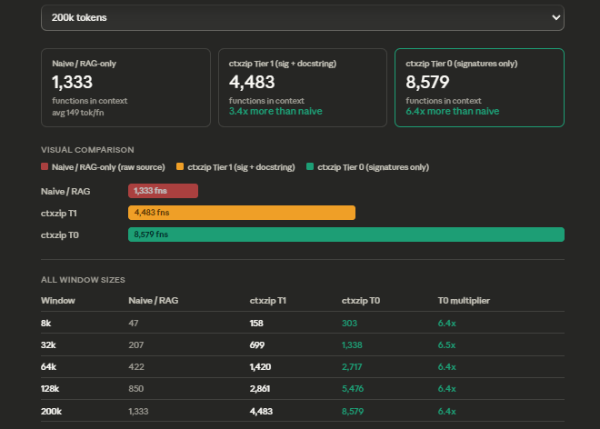

# ctxzip — MCP codebase context (semantic search)

**ctxzip** is **source-available** under the [Business Source License 1.1](LICENSE) (BUSL-1.1): a [Model Context Protocol (MCP)](https://modelcontextprotocol.io) server that indexes a project’s source files, builds a compressed “directory” of all symbols, and retrieves **semantic** (embedding) or **TF‑IDF** context for coding tasks—so your agent gets relevant code without stuffing the full repo into the prompt.

See [LICENSE](LICENSE) for parameters (including **Additional Use Grant**: free for individual developers and non-commercial use; **Change Date** 2029-01-01; **Change License** Apache 2.0). Install from a Git clone: dependencies, point your MCP client at `mcp_server.py`, and index your repo. Issues and pull requests are welcome.

## What ctxzip does

ctxzip **parses your codebase** into functions and classes, then serves them to the model in **layers** instead of dumping raw files:

1. **Tier 0 — signatures only** — Every symbol appears in a compact “phone book”: name, signature, file, line range. The model sees the **shape** of the whole codebase at low token cost.
2. **Tier 1 — signature + docstring** — For the chunks that best match the task (semantic or TF‑IDF search), ctxzip adds short **docstring-style summaries** so the model understands intent without full bodies.
3. **Tier 2 — full source** — When the task looks like an **edit**, ctxzip includes the **complete raw source** for the best target chunk. For anything else, the model can call **`ctxzip_get_source`** to pull full text for any `cx_…` id from Tier 0, or **`ctxzip_get_function`** (file path + line) to retrieve a full enclosing function/class from disk via Tree-sitter (best for large symbols split across index chunks).

**There is no loss in this compression.** Nothing is thrown away: the index **stores full source** for every chunk. Tier 0 and Tier 1 only change **how much you put in the default context window**—like showing a map and highlights before opening a full file. Raw code is always recoverable from the index or via tools.

Semantic search picks **relevant** chunks for Tier 1 so the model spends tokens on code that matters to the question, not on unrelated files.

## Context efficiency (benchmark)

Compared to putting **full raw source** for every function into the window (“naive / RAG-only”), ctxzip’s tiers fit **far more of the codebase** into the same token budget—because signatures and docstrings are tiny next to whole implementations.



Approximate **functions that fit** in a single context window (same methodology as the chart above):

| Window | Naive / raw source | ctxzip Tier 1 (sig + docstring) | ctxzip Tier 0 (signatures only) | Tier 0 vs naive |
|--------|-------------------|-----------------------------------|-----------------------------------|-----------------|
| 8k     | ~47               | ~158                              | ~303                              | **~6.4×**       |
| 32k    | ~207              | ~699                              | ~1,338                            | **~6.5×**       |
| 64k    | ~422              | ~1,420                            | ~2,717                            | **~6.4×**       |
| 128k   | ~850              | ~2,861                            | ~5,476                            | **~6.4×**       |
| 200k   | ~1,333            | ~4,483                            | **~8,579**                        | **~6.4×**       |

At **200k tokens**, Tier 0 fits on the order of **6.4×** as many functions as naive full-source packing; Tier 1 fits about **3.4×**—still a large gain while carrying richer summaries. Your absolute numbers depend on project and tokenizer; the pattern is consistent: **structured views scale better than pasting every body.**

### Real project example (`ctxzip_stats`)

On a large full-stack codebase indexed with ctxzip, **`ctxzip_stats`** reported:

| Metric | Value |
|--------|--------|
| **Chunks** | 1,941 across 336 files |
| **Languages** | TypeScript 1,309 · Python 344 · Swift 208 · JavaScript 80 |
| **Embeddings** | 1,941 / 1,941 (100%) — semantic search |
| **Raw vs Tier 0** | **~1.54M tokens** (full source) → **~63.8k tokens** for the all-signatures “directory” (**~96%** savings) |

So the **entire** indexed codebase fits in the Tier 0 map at tens of thousands of tokens instead of well over a million—while full source for any symbol stays in the index for retrieval.

## Features

- **Five tools:** `ctxzip_index`, `ctxzip_query`, `ctxzip_get_source`, `ctxzip_get_function`, `ctxzip_stats`
- **Tiered context:** signatures for everything (Tier 0), docstring summaries for top matches (Tier 1), full source for an edit target when intent is “edit” (Tier 2)
- **Semantic search** when `OPENAI_API_KEY` is set (`text-embedding-3-small`); otherwise **TF‑IDF** fallback
- **`ANTHROPIC_API_KEY` + Haiku** — used **only at index time** to **fill in missing docstrings** for symbols that do not already have one in source (Python docstrings, JSDoc, etc.). Each call uses **Claude Haiku** to write a short summary so every chunk has text suitable for **Tier 1** and for **embedding / retrieval**. If large parts of the codebase lack docstrings and you skip Anthropic, Tier 1 stays weak (placeholders like `Function: …`) and **semantic search and query quality suffer**—ctxzip still works mechanically, but it will not map or rank the codebase well. Prefer setting `ANTHROPIC_API_KEY` for a full index unless you already document most symbols.
- **Languages:** Python, JS/TS, Go, Rust, Java, C/C++, Ruby, PHP, Swift, Kotlin, Scala (plus line-based fallback)
- **Persistent index:** `.ctxzip_index.json` in this directory (or set `CTXZIP_INDEX`; see below)

## Requirements

- Python **3.11+**
- Network access for OpenAI (if using embeddings) / Anthropic (if using generated docstrings)

## Quick start (local / Cursor / Claude Desktop)

1. Clone this repository (or copy the `ctxzip` folder into your own project).

2. Create a virtual environment (recommended):

   ```bash
   python -m venv .venv
   .venv\Scripts\activate          # Windows
   # source .venv/bin/activate      # macOS / Linux
   pip install -r requirements.txt
   ```

3. Copy `.env.example` to `.env` and add at least `OPENAI_API_KEY` for semantic search.

4. Register the server (stdio transport).

### Cursor

**Project** config: `.cursor/mcp.json` next to your app:

```json
{
  "mcpServers": {
    "ctxzip": {
      "command": "/absolute/path/to/ctxzip/.venv/bin/python",
      "args": ["/absolute/path/to/ctxzip/mcp_server.py"]
    }
  }
}
```

On Windows, use `\\.venv\\Scripts\\python.exe` and `mcp_server.py` paths.

If you use `.env` beside `mcp_server.py`, you do **not** need to duplicate keys in `mcp.json`.

### Claude Desktop

`claude_desktop_config.json` (see [Claude docs](https://docs.anthropic.com)) — same `command` / `args` pattern as above. Optional `env` block for API keys.

## Tools (for agents)

| Tool | Purpose |
|------|---------|
| `ctxzip_index` | Index a file or directory; refresh embeddings; merge/replace stale chunks |
| `ctxzip_query` | Given a natural-language task, return Tier 0 + Tier 1 (+ Tier 2 for edits) |
| `ctxzip_get_source` | Fetch full source for a chunk id (`cx_…`) from the directory |
| `ctxzip_get_function` | Given a **file path** and **line number** (or optional `chunk_id`), return the **full enclosing function/class** (Tree-sitter); use when a symbol spans multiple chunks or `ctxzip_get_source` is incomplete |
| `ctxzip_stats` | Chunks, languages, embedding/doc coverage, token breakdown |

Typical flow: **`ctxzip_index`** once per project (or after large changes), then **`ctxzip_query`** for each task; use **`ctxzip_get_function`** when you need the whole logical symbol around a line.

## Environment variables

| Variable | Role |
|----------|------|
| `OPENAI_API_KEY` | Semantic embeddings (recommended) |
| `ANTHROPIC_API_KEY` | At **index time only**: **Claude Haiku** generates a docstring for each symbol that does not already have one in source—those strings drive **Tier 1** and **embedding text**, so skipping this key when most functions lack docs yields poor retrieval (see above). |
| `CTXZIP_INDEX` | Optional absolute path to the index JSON file (default: `.ctxzip_index.json` next to `mcp_server.py`) |

Indexing sends code excerpts to **OpenAI** (embeddings) and, when docstrings are missing, to **Anthropic Haiku** (summaries). Use only on code you are allowed to process.

### Approximate Haiku cost for a **full** index (docstring generation)

Costs below are **order-of-magnitude estimates** for projects where **many** symbols need Haiku (no existing docstring). Symbols that already have docstrings incur **no** Haiku call. Pricing moves with Anthropic’s published rates—check [Anthropic pricing](https://www.anthropic.com/pricing) for current Haiku input/output $/MTok. Rough math assumes ~0.8–2k input tokens + ~100–200 output tokens per generated docstring (see `docstrings.py`: up to ~2k chars of source per call).

| Scale (approx. indexed chunks / functions) | Typical full-index Haiku cost (USD, indicative) |
|---------------------------------------------|---------------------------------------------------|
| **~500** | **~$0.50 – $2** |
| **~2,000** | **~$2 – $8** |
| **~5,000** | **~$5 – $20** |

Narrow the range if your team already documents APIs heavily (fewer Haiku calls), or widen if chunks are very large. **OpenAI embedding** costs for the same index are separate (`text-embedding-3-small`); see OpenAI’s pricing page for embedding $/MTok.

## CLI (optional)

Same folder, same venv:

```bash
python ctxzip.py index /path/to/project
python ctxzip.py query "how does authentication work?"
python ctxzip.py stats
```

## License

[Business Source License 1.1](LICENSE) (BUSL-1.1). After the **Change Date** (2029-01-01), the software is available under **Apache License, Version 2.0** as stated in `LICENSE`. Additional production use beyond the grant may require a commercial license from the licensor—read the full text.

## More detail

- [MCP_SETUP.md](MCP_SETUP.md) — Cursor / Claude examples and search modes  
- [OPENCLAW.md](OPENCLAW.md) — using ctxzip with **OpenClaw** (`openclaw.json`, [openclaw.json.example](openclaw.json.example))
